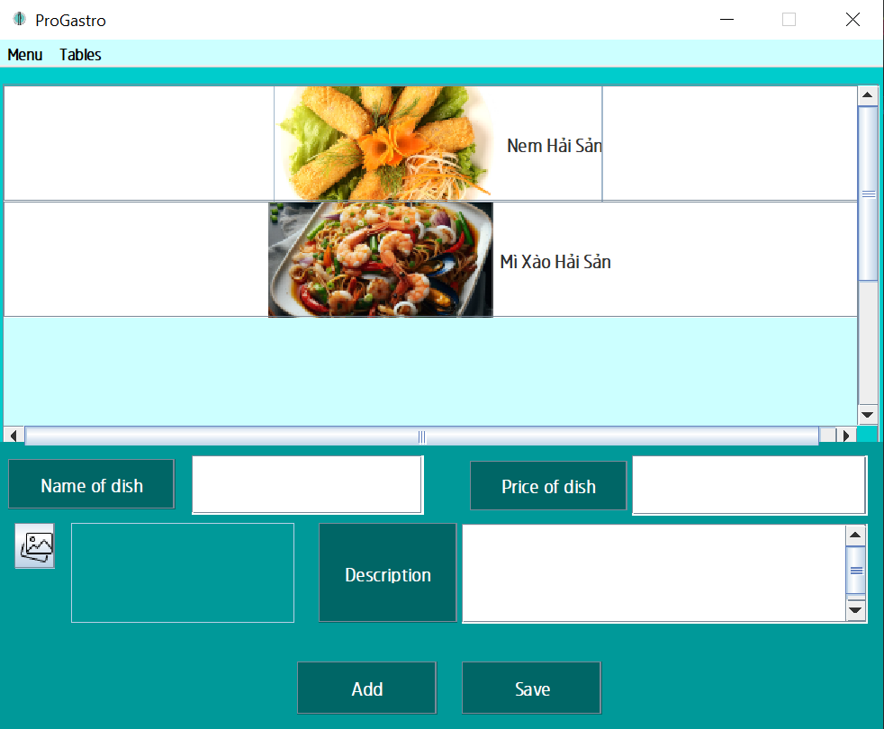
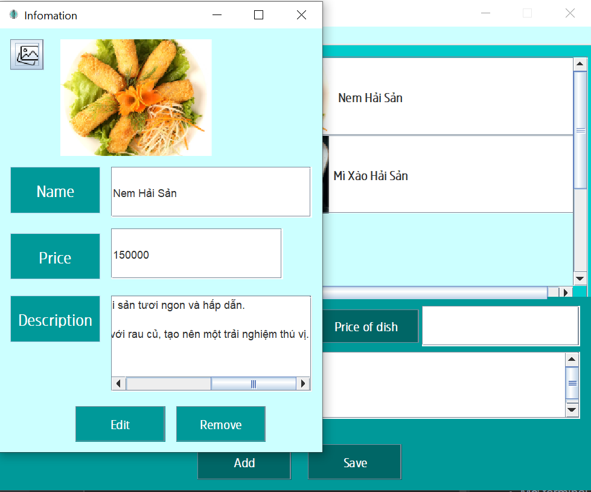
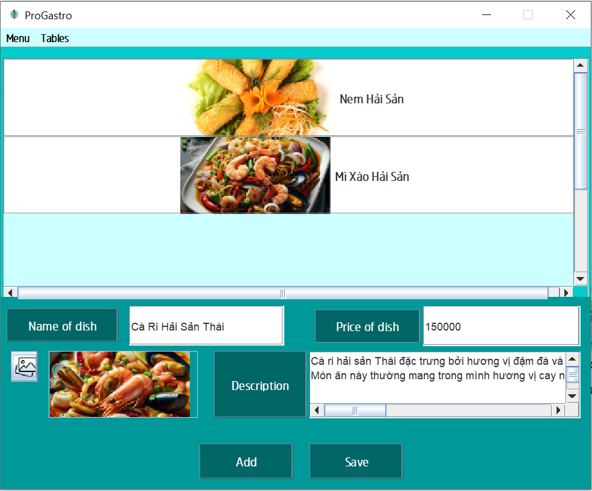
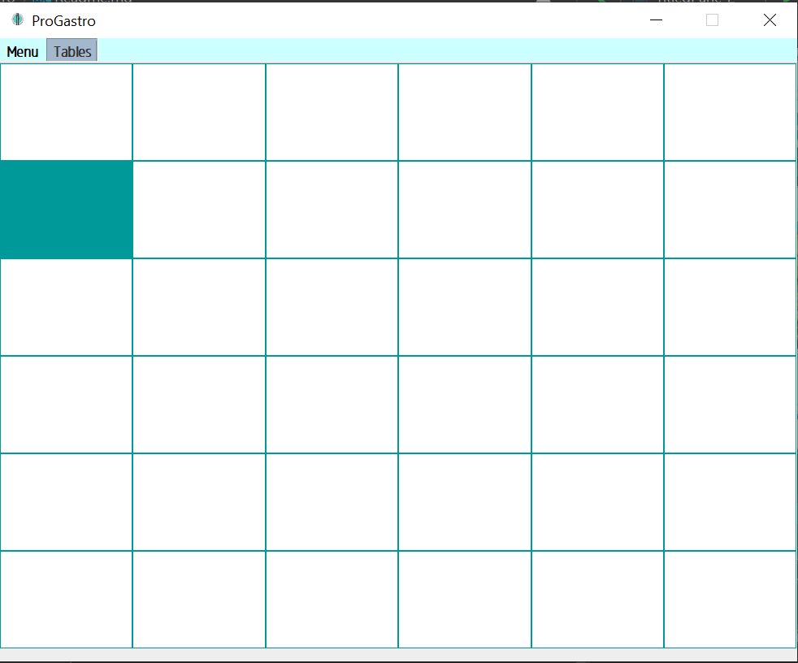
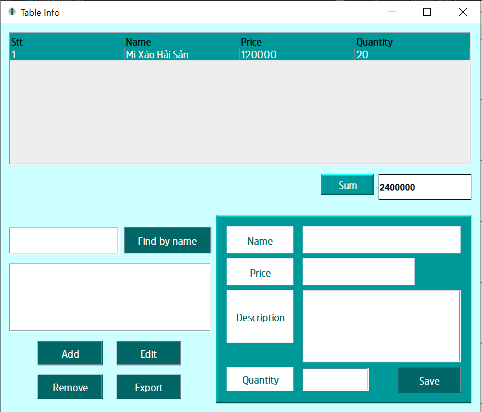
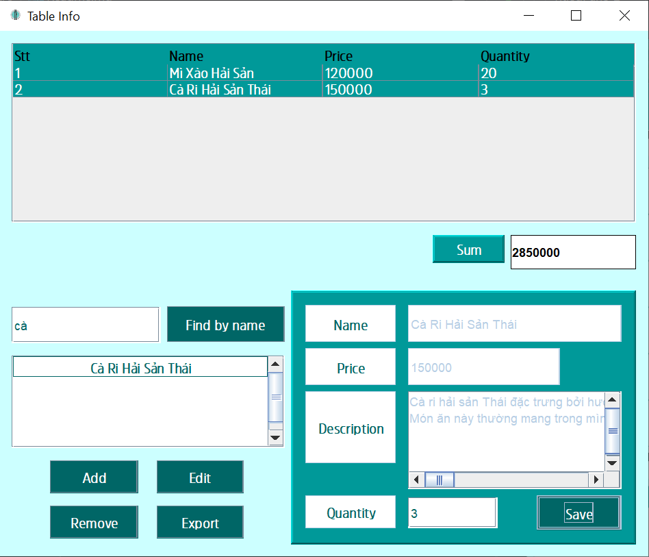
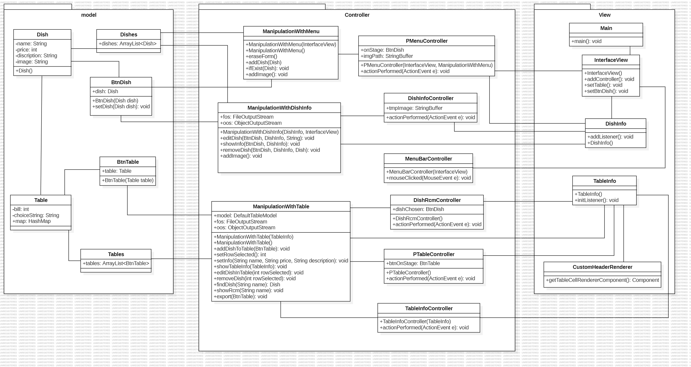
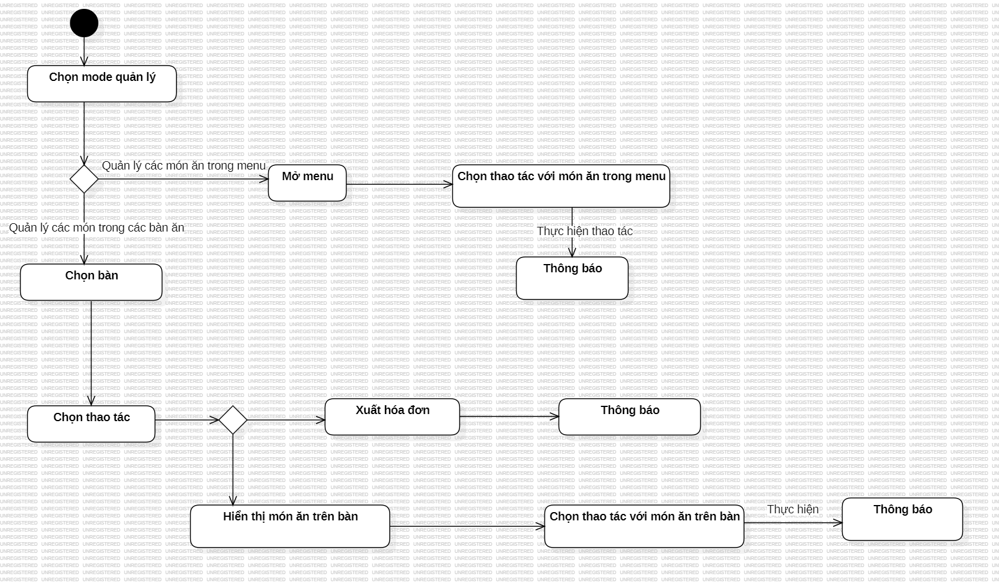

# ProGastro
### Dứng dụng quản lý nhà hàng

Để giúp những người chủ nhà hàng có thể kiểm soát dễ dàng hơn nhà hàng của mình, chúng tôi đưa ra ứng dụng "Quản lý nhà hàng".

Ứng dụng cung cấp các chức năng thêm, sửa, xóa menu cùng với quản lý các bàn ăn trong nhà hàng.

### Authors
[@DoangVan411](https://github.com/DoangVan411)

### Demo
[Link Youtube](https://www.youtube.com/watch?v=83FgQZtZ-fI)

### Screenshots

### Features
- Thêm, sửa, xóa các món ăn trong menu
- Thêm, sửa, xóa các món ăn trong từng bàn cụ thể
- Xuất hóa đơn cho từng bàn

### Requirements
- Java 21
- Source/Binary Format: JDK 21 
- Profile: Full JRE
- Encoding: UTF-8

### UML
#### Class Diagram

#### Activity Diagram

### Installation
Cách cài đặt dự án

- Clone dự án
- Chạy class Main.java

### License
[MIT](https://choosealicense.com/licenses/mit/)
